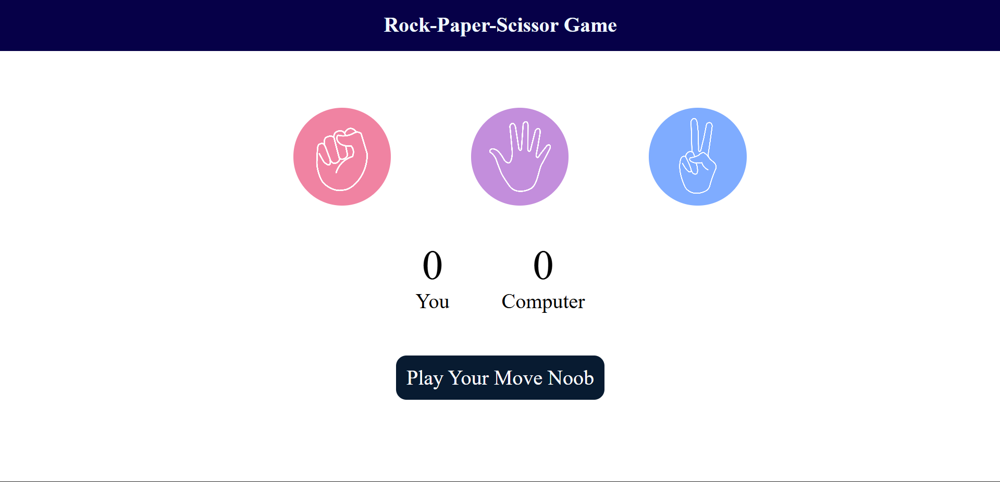

🪨📄✂️ Rock Paper Scissors Game
A clean, interactive Rock Paper Scissors game built with HTML, CSS, and vanilla JavaScript. Play against the computer and keep track of your score!

✨ Features
Interactive UI: Click on your choice (Rock, Paper, or Scissors) to play.

Computer Opponent: A simple AI randomly selects its move.

Score Tracking: The game keeps a running tally of the user's score vs. the computer's score.

Instant Feedback: The game message updates to tell you if you won, lost, or drew the round.

Visual Cues: The message box changes color based on the outcome:

Green for a win

Red for a loss

Dark Blue for a draw

🎮 How to Play
Open the game: Open the index.html file in any web browser.

Make your move: Click on the Rock, Paper, or Scissors image.

See the result: The computer will make its choice, and the game will display the winner and update the scores.

Keep playing: There's no round limit. Play as long as you like!

💻 Technologies Used
This project is built using fundamental web technologies:

HTML5: Provides the structure and content of the game.

CSS3: Handles all styling, layout, and visual effects (like the hover state).

Vanilla JavaScript (ES6+): Powers the entire game logic, including event handling, choice generation, and DOM manipulation.

🚀 Getting Started
To run this project on your local machine, follow these simple steps:

Clone the repository:

Bash

git clone https://github.com/YOUR_USERNAME/YOUR_REPOSITORY.git
Navigate to the project directory:

Bash

cd your-repository-name
Ensure you have images: The index.html file looks for images in an /images folder. Make sure you have the following files in that folder:

images/rock.png

images/paper.png

images/scissors.png

Open the game: Simply double-click the index.html file to open it in your default web browser.

📄 License
This project is open-source and available under the MIT License.
